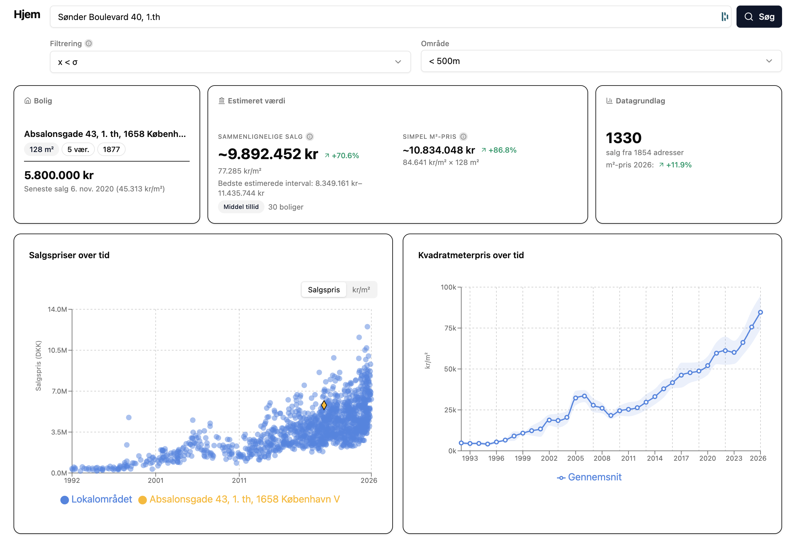

# Hjem

A Danish property valuation tool. Enter any Danish address and a search radius, and Hjem aggregates recent sales from [Boliga.dk](https://www.boliga.dk), canonical address data from [DAWA](https://api.dataforsyningen.dk), and public valuations from [Dingeo](https://www.dingeo.dk) to produce three independent price estimates.

Built for home buyers who want a data-driven baseline before negotiating — without relying solely on an estate agent's appraisal.



## Features

- **Comparable sales estimate** — Gaussian-weighted analysis of recent nearby sales, adjusted for size, room count, build year, and geographic distance, then market-adjusted to current price levels using the area trend
- **Square-meter average estimate** — the area's mean DKK/m² for the chosen radius multiplied by the property's size
- **Public valuations** — aggregated mean of external valuation models (Skat, Realkredit, Geomatics AVM, Vertex AI, and others) fetched from Dingeo
- **Interactive charts** — sale prices and DKK/m² over time, switchable between views
- **Sortable sales table** — every sale in the radius with DKK/m², deviation from the mean, and hover details
- **Address exclusion** — remove individual addresses from the table to recalculate estimates
- **IQR outlier filtering** — robust interquartile-range filtering with configurable sensitivity
- **Whole-building sale removal** — automatically discards bulk portfolio transactions where the same total price appears across three or more apartments at the same address on the same date
- **Year-over-year change** — shown for the most recent sale, estimated value, and DKK/m²
- **Partial results with warnings** — if some streets fail to fetch, available data is returned alongside a warning rather than aborting
- **Caching** — Boliga data is cached for 10 days in PostgreSQL or SQLite; DAWA query results are cached for one year

## Quick Start with Docker

```shell
docker run -p 8080:8080 ghcr.io/simonottosen/hjem
```

Open `http://localhost:8080` in your browser.

## Running Locally

Prerequisites: **Go 1.23+** and **Node.js 22+**.

Build the frontend bundle first, then start the Go server:

```shell
# 1. Build the React frontend (output goes to frontend/dist/)
cd frontend
npm install
npm run build
cd ..

# 2. Start the backend (defaults: port 8080, SQLite hjem.db)
go run app/main.go
```

For active frontend development, run both processes simultaneously. Vite proxies `/api` and `/download` to the Go backend at `:8080`:

```shell
# Terminal 1 — Go backend
go run app/main.go

# Terminal 2 — Vite dev server at :3000
cd frontend
npm run dev
```

### CLI Flags

| Flag | Default | Description |
|------|---------|-------------|
| `-port` | `8080` | Port the HTTP server listens on |
| `-db-file` | `hjem.db` | Path to the SQLite database file |

Example:

```shell
go run app/main.go -port 9090 -db-file /var/data/hjem.db
```

## Docker Deployment

### Minimal (SQLite, no Dingeo)

```shell
docker run -p 8080:8080 ghcr.io/simonottosen/hjem
```

SQLite is used by default. The database file is written to `/data/hjem.db` inside the container.

### With a persistent data volume

```shell
docker run -p 8080:8080 -v $(pwd)/data:/data ghcr.io/simonottosen/hjem
```

### With PostgreSQL

Set `POSTGRES_PASSWORD` to switch from SQLite to PostgreSQL. The server attempts a PostgreSQL connection on startup and falls back to SQLite if the connection fails.

```shell
docker run -p 8080:8080 \
  -e POSTGRES_PASSWORD=yourpassword \
  -e POSTGRES_HOST=postgres \
  -e POSTGRES_PORT=5432 \
  -e POSTGRES_DB=hjem \
  ghcr.io/simonottosen/hjem
```

Create the database before starting:

```shell
docker exec -it postgres psql -U postgres -c "CREATE DATABASE hjem;"
```

### With Dingeo valuations via FlareSolverr

Dingeo is protected by Cloudflare bot detection. To enable the public valuations panel, run [FlareSolverr](https://github.com/FlareSolverr/FlareSolverr) and point `FLARESOLVERR_URL` at it. Without this variable, Dingeo lookups are skipped and the rest of the tool continues normally.

```shell
docker run -p 8080:8080 \
  -e FLARESOLVERR_URL=http://flaresolverr:8191 \
  ghcr.io/simonottosen/hjem
```

### Build from source

```shell
docker build -t hjem .
docker run -p 8080:8080 hjem
```

The multi-stage Dockerfile builds the React frontend with Node 22 Alpine, then compiles the Go binary with CGO enabled (required for SQLite), and produces a minimal Alpine final image.

## Environment Variables

| Variable | Required | Default | Description |
|----------|----------|---------|-------------|
| `POSTGRES_PASSWORD` | No | — | Enables PostgreSQL. If set, the server connects to PostgreSQL instead of SQLite |
| `POSTGRES_HOST` | No | `localhost` | PostgreSQL host |
| `POSTGRES_PORT` | No | `8777` | PostgreSQL port |
| `POSTGRES_USER` | No | `postgres` | PostgreSQL user |
| `POSTGRES_DB` | No | `hjem` | PostgreSQL database name |
| `FLARESOLVERR_URL` | No | — | URL of a running FlareSolverr instance (e.g. `http://flaresolverr:8191`). Enables Dingeo valuation fetching |

## API Reference

All endpoints are served by the Go backend. The frontend is embedded into the binary at build time.

### `GET /`

Returns the single-page web application.

### `POST /api/lookup`

Starts an asynchronous property lookup. Returns `202 Accepted` immediately. Poll `/api/progress` for status and results.

Request body:

```json
{
  "q": "Palnatokesvej 34, st. tv, 5000",
  "ranges": [500],
  "filter_below_std": 1
}
```

| Field | Type | Description |
|-------|------|-------------|
| `q` | string | Danish address query string (fuzzy-matched via DAWA) |
| `ranges` | array of int | Search radii in metres, e.g. `[250, 500]` |
| `filter_below_std` | int | IQR multiplier for outlier filtering. `0` disables filtering. `1` uses multiplier `1.5` (strict), `2` uses `2.0`, `3` uses `2.5` (lenient) |

Response:

```json
{ "status": "accepted" }
```

If a lookup is already in progress, posting a new request cancels the previous one.

### `GET /api/progress`

Returns the current stage and, once complete, the full result payload.

```json
{
  "stage": "done",
  "message": "Faerdig!",
  "current": 0,
  "total": 0,
  "elapsed_ms": 4821,
  "warnings": [],
  "result": { ... }
}
```

Progress stages in order: `idle` → `dawa` → `boliga_list` → `done` (or `error`).

The `result` field is populated only when `stage` is `"done"`.

### `GET /api/health`

Returns operational metrics as JSON.

```json
{
  "uptime_seconds": 3600,
  "total_lookups": 42,
  "cache": { "hits": 310, "misses": 28 },
  "boliga": {
    "total_ok": 118,
    "total_fail": 2,
    "error_rate_pct": 1.67
  },
  "recent_errors": []
}
```

### `GET /metrics`

Exposes Prometheus metrics in the standard text exposition format.

| Metric | Type | Description |
|--------|------|-------------|
| `hjem_uptime_seconds` | gauge | Seconds since server start |
| `hjem_lookups_total` | counter | Total address lookups performed |
| `hjem_cache_hits_total` | counter | Boliga data served from cache |
| `hjem_cache_misses_total` | counter | Boliga data fetched from the network |
| `hjem_boliga_requests_total{result="ok"}` | counter | Successful Boliga API calls |
| `hjem_boliga_requests_total{result="fail"}` | counter | Failed Boliga API calls |
| `hjem_recent_errors{type="..."}` | gauge | Recent errors grouped by type (last 20) |

A Grafana dashboard is available at `grafana/dashboard.json`.

### `GET /download/csv`

Downloads all sales for a given address and radius as a CSV file.

Query parameters: `q` (address string) and `range` (radius in metres).

Example: `/download/csv?q=Palnatokesvej+34+5000&range=500`

## How the Three Estimates Work

### 1. Comparable Sales (Comps)

The comps estimate uses a weighted average of recent nearby sales, adjusted to reflect current market levels.

Each comparable sale is scored by four independent weights that are multiplied together:

| Factor | Method | Parameters |
|--------|--------|------------|
| Recency | Exponential decay | Half-life ~2.3 years (`lambda = 0.3`) |
| Size similarity | Gaussian | Sigma = 25% size difference |
| Room count similarity | Gaussian | Sigma = 1.5 rooms |
| Build year similarity | Gaussian | Sigma = 20 years |
| Geographic distance | Half-weight decay | Half-weight at 200 m |

Before weighting, each sale's DKK/m² price is market-adjusted by the ratio of the area's current mean DKK/m² to the mean in the sale's year. This corrects for market appreciation over time.

A minimum of 3 comparable sales are required to produce an estimate. Up to 30 comparables (by weight) are used. The output includes a point estimate, lower and upper bounds (one weighted standard deviation), and a confidence level (`high`, `medium`, or `low`) based on the number of comparables and the spread of the range.

The primary address's own sales are excluded from the comparable pool.

### 2. Square-Meter Average

The area's mean DKK/m² across all sales in the selected radius (after outlier filtering) is multiplied by the primary property's floor area. This estimate does not account for individual property characteristics and is most useful as a market-level sanity check.

Year-over-year projections are generated for properties with prior sales by applying the ratio of that sale's DKK/m² to the area mean at the time, then scaling forward using the area's trend.

### 3. Public Valuations (Dingeo)

Dingeo aggregates valuations from multiple external models including the Danish tax authority (Skat), Realkredit Danmark, Geomatics AVM, and Vertex AI. Hjem fetches the mean and individual model values for the primary address. This estimate is optional and requires FlareSolverr (see [Environment Variables](#environment-variables)).

## Data Sources and Limitations

### Data sources

| Source | What it provides | API |
|--------|-----------------|-----|
| [Boliga.dk](https://www.boliga.dk) | Historical sale prices, property size, rooms, build year | `https://api.boliga.dk/api/v2/sold/search/results` |
| [DAWA](https://dawadocs.dataforsyningen.dk) | Canonical Danish address registry, geocoordinates, nearby address search | `https://api.dataforsyningen.dk/adresser` |
| [Dingeo](https://www.dingeo.dk) | Aggregated public valuation models | Via FlareSolverr or direct request |

### What Boliga data includes

Only **regular arm's-length sales** (`"Alm. Salg"`) are included. Family transfers, forced sales, and other non-market transactions are filtered out. Whole-building portfolio transactions — where the same total price is recorded against three or more apartments at the same street and number on the same date — are also removed, as these do not represent individual property prices.

### What the estimates do not account for

- Interior renovations, extensions, or structural changes
- The current condition and maintenance state of the property
- Shifts in neighbourhood desirability or planned infrastructure
- Prevailing interest rates and financing conditions
- Property-specific features (garden size, views, parking, etc.)

All three estimates are statistical models based on comparable transactions and should be treated as informed baselines, not appraisals.

## Running Tests

```shell
go test ./...
```

## Project Structure

```
.
├── api.go           # HTTP routes and lookup orchestration
├── boliga.go        # Boliga.dk scraper with 10-day DB caching
├── comps.go         # Gaussian-weighted comparable sales estimation
├── dawa.go          # DAWA address API integration
├── dingeo.go        # Dingeo + FlareSolverr valuation fetcher
├── health.go        # /api/health and /metrics handlers
├── http.go          # Shared HTTP client with retry/backoff logic
├── math.go          # IQR outlier filtering and year-over-year stats
├── models.go        # GORM domain models (Address, Sale, DawaQueryCache)
├── progress.go      # Async progress tracking with mutex
├── app/
│   └── main.go      # Entry point: CLI flags, DB init, server start
├── frontend/
│   ├── src/
│   │   ├── App.tsx                  # Root state and progress polling
│   │   ├── hooks/useSearch.ts       # POST /api/lookup
│   │   ├── hooks/useProgress.ts     # Poll /api/progress
│   │   ├── hooks/useFilteredData.ts # Client-side address exclusion
│   │   ├── lib/compute.ts           # Client-side comps and projections
│   │   ├── lib/api.ts               # fetch() wrappers
│   │   └── lib/types.ts             # TypeScript interfaces
│   └── package.json
├── grafana/
│   └── dashboard.json   # Importable Grafana dashboard
└── Dockerfile
```

## Asynchronous Request Model

Lookups do not block the HTTP response. When the frontend sends `POST /api/lookup`, the server spawns a goroutine and returns `202 Accepted` immediately. The frontend polls `GET /api/progress` every ~500 ms. The server writes to a `Progress` struct as each stage completes (DAWA lookup, Boliga fetch, estimation, Dingeo). This avoids timeout issues with long-running reverse-proxy setups.

If a new lookup is submitted before the previous one finishes, the previous goroutine's context is cancelled and its result is discarded.

## License

MIT. Originally created by [Thomas Panum](https://github.com/tpanum). Maintained by [Simon Ottosen](https://github.com/simonottosen).

This tool reads only from publicly available sources. Use at your own risk.
